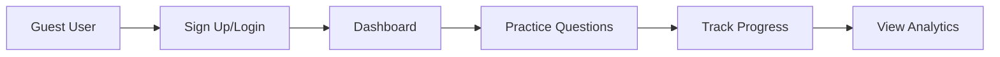
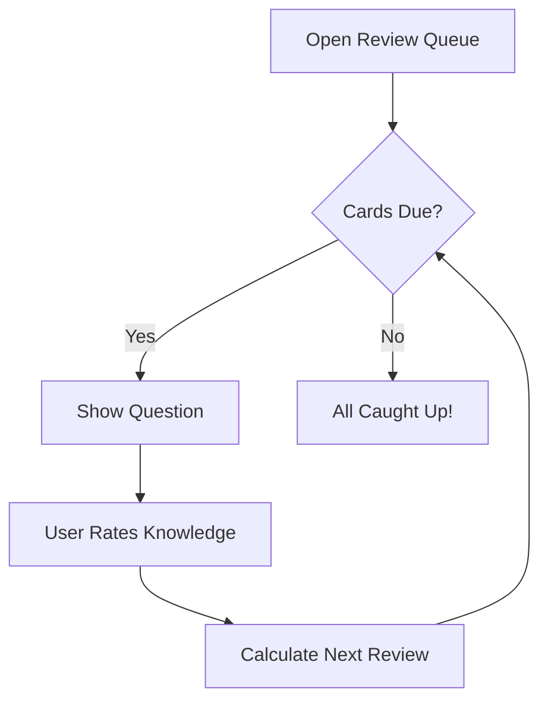

# NullPtr Feature Suggestions

## 📊 Current State Analysis

**NullPtr** is a comprehensive study platform for CS & Engineering students with:
- **3 Question Types**: MCQs, Fill-in-the-Blanks, Descriptive Q&A
- **PWA Support**: Offline functionality with service workers
- **Admin Panel**: Full CRUD operations for content management
- **Rich Content**: Image support, code blocks, diagrams in answers
- **PDF Export**: Customizable study guide generation
- **Second Space**: Private content access via secret key

---

## 🚀 Proposed New Features

### 1. User Authentication & Progress Tracking

**Priority: High | Impact: High**

#### Description
Add user accounts to track individual learning progress across devices.

#### Features
- Email/password and OAuth authentication (Google, GitHub)
- Progress tracking per subject, unit, and question type
- Score history and performance analytics
- Bookmarks/favorites for questions
- Spaced repetition reminders

#### Technical Implementation
```
frontend/src/
├── contexts/AuthContext.tsx (update existing)
├── pages/Profile.tsx
├── pages/Progress.tsx
├── components/ProgressChart.tsx

backend/src_temp/
├── models/User.js
├── models/Progress.js
├── controllers/authController.js
├── controllers/progressController.js
```

#### User Flow


---

### 2. Quiz Mode with Timer

**Priority: High | Impact: High**

#### Description
Add a timed quiz mode for exam simulation with randomized questions.

#### Features
- Configurable timer per quiz session
- Random question selection from selected units
- Question shuffle option
- Score calculation with detailed breakdown
- Quiz history and performance comparison
- Pause/resume functionality

#### UI Components
```tsx
// New components needed
<QuizSetupDialog />     // Configure quiz parameters
<QuizTimer />           // Countdown display
<QuizProgress />        // Question navigation
<QuizResults />         // Score breakdown
<QuizHistory />         // Past quiz attempts
```

#### Quiz Configuration Options
- Number of questions
- Time limit (per question or total)
- Question types to include
- Difficulty level filter
- Negative marking toggle

---

### 3. Spaced Repetition System

**Priority: Medium | Impact: High**

#### Description
Implement a flashcard-style review system using spaced repetition algorithms.

#### Features
- Mark questions as: Know, Somewhat Know, Dont Know
- SM-2 algorithm for review scheduling
- Daily review queue
- Streak tracking
- Review reminders via notifications

#### Algorithm Implementation
```typescript
interface ReviewCard {
  questionId: string;
  easeFactor: number;    // Default: 2.5
  interval: number;      // Days until next review
  repetitions: number;   // Consecutive correct answers
  nextReviewDate: Date;
}

function calculateNextReview(card: ReviewCard, quality: 0-5): ReviewCard {
  // SM-2 Algorithm implementation
}
```

#### UI Flow


---

### 4. Collaborative Features

**Priority: Medium | Impact: Medium**

#### Description
Enable social learning through shared content and discussions.

#### Features
- Public study sets shared by users
- Comments/discussions on questions
- Report incorrect questions
- Community contributions (pending admin approval)
- Study groups

#### Database Schema Additions
```javascript
// Comment Schema
{
  questionId: String,
  questionType: String, // mcq | fillblank | descriptive
  userId: String,
  content: String,
  createdAt: Date,
  likes: Number
}

// StudyGroup Schema
{
  name: String,
  description: String,
  members: [String],
  subjects: [String],
  createdBy: String
}
```

---

### 5. AI-Powered Features

**Priority: Medium | Impact: High**

#### Description
Integrate AI to enhance learning and content creation with flexible backend options.

#### Features
- **AI Explanations**: Generate explanations for questions lacking them
- **Question Generation**: Create new questions from topics
- **Hint System**: Progressive hints for stuck students
- **Natural Language Search**: Find questions by describing concepts
- **Difficulty Prediction**: Auto-suggest difficulty levels
- **Chat with Content**: Ask questions about study material

#### AI Backend Options

**Option 1: Ollama (Local/Free)**
```typescript
// Ollama integration - runs locally, no API costs
interface OllamaService {
  baseUrl: string; // Default: http://localhost:11434
  model: string;   // Options: llama2, mistral, codellama, etc.
}

async function generateWithOllama(prompt: string, model: string = 'llama2'): Promise<string> {
  const response = await fetch('http://localhost:11434/api/generate', {
    method: 'POST',
    headers: { 'Content-Type': 'application/json' },
    body: JSON.stringify({
      model,
      prompt,
      stream: false
    })
  });
  return (await response.json()).response;
}
```

**Option 2: User-Provided API Key**
```typescript
// User brings their own API key - stored securely in localStorage
interface AIProviderConfig {
  provider: 'openai' | 'anthropic' | 'google' | 'groq';
  apiKey: string;  // User's own API key
  model?: string;  // Optional model selection
}

// Settings page for API configuration
function AISettingsPanel() {
  const [config, setConfig] = useState<AIProviderConfig>({
    provider: 'openai',
    apiKey: '',
    model: 'gpt-4o-mini'
  });

  return (
    <div>
      <Select value={config.provider} onChange={...}>
        <option value="openai">OpenAI (GPT-4, GPT-4o)</option>
        <option value="anthropic">Anthropic (Claude)</option>
        <option value="google">Google (Gemini)</option>
        <option value="groq">Groq (Fast Inference)</option>
      </Select>
      <Input type="password" placeholder="Enter your API key" />
    </div>
  );
}
```

**Option 3: Hybrid Approach**
```typescript
// Smart routing based on availability
async function generateAIResponse(prompt: string): Promise<string> {
  // 1. Check for user API key first
  const userKey = getUserAPIKey();
  if (userKey) {
    return callExternalAPI(userKey, prompt);
  }

  // 2. Fall back to local Ollama if available
  if (await isOllamaAvailable()) {
    return generateWithOllama(prompt);
  }

  // 3. Show setup dialog if neither available
  throw new Error('AI_NOT_CONFIGURED');
}
```

#### AI Features UI Components
```tsx
<AISettingsDialog />      // Configure AI provider and API key
<AIExplanationButton />   // Generate explanation for current question
<AIHintButton />          // Get progressive hints
<AIQuestionGenerator />   // Admin: Generate questions from topic
<AIChatSidebar />         // Chat with AI about current content
```

#### Admin AI Tools
```typescript
// Bulk generate questions from topic outline
interface QuestionGenerationRequest {
  topic: string;
  count: number;
  types: ('mcq' | 'fillblank' | 'descriptive')[];
  difficulty: 'easy' | 'medium' | 'hard';
  context?: string;  // Additional context/material
}

// AI-assisted content improvement
interface ContentEnhancement {
  improveExplanation: (explanation: string) => Promise<string>;
  generateCodeExample: (concept: string) => Promise<string>;
  suggestRelatedTopics: (question: string) => Promise<string[]>;
}
```

#### Privacy Considerations
- API keys stored locally (never sent to NullPtr servers)
- Option to disable AI features entirely
- Clear indication when AI is being used
- User consent before sending content to external APIs

---

### 6. Enhanced Analytics Dashboard

**Priority: Medium | Impact: Medium**

#### Description
Comprehensive analytics for both students and admins.

#### Student Analytics
- Performance by subject/unit
- Time spent per question type
- Accuracy trends over time
- Weak areas identification
- Comparison with peers (anonymized)

#### Admin Analytics
- Content engagement metrics
- Most/least practiced questions
- Error rate analysis
- User retention stats
- Content gap analysis

#### Visualization Components
```tsx
<PerformanceChart />     // Line chart for progress
<AccuracyPieChart />     // Subject-wise accuracy
<HeatmapCalendar />      // Daily activity like GitHub
<WeakAreasRadar />       // Radar chart for topics
<Leaderboard />          // Top performers
```

---

### 7. Mobile App Enhancements

**Priority: Medium | Impact: High**

#### Description
Improve mobile experience and add native features.

#### Features
- Pull-to-refresh on all pages
- Swipe gestures for question navigation
- Haptic feedback on answers
- Native sharing to apps
- Quick actions from home screen
- Offline indicator improvements
- Background sync

#### PWA Improvements
```javascript
// Add to existing service worker
self.addEventListener('sync', event => {
  if (event.tag === 'sync-progress') {
    event.waitUntil(syncUserProgress());
  }
});

// Push notifications for review reminders
self.addEventListener('push', event => {
  const options = {
    body: 'You have 10 cards due for review!',
    icon: '/android-chrome-192x192.png',
    badge: '/favicon-32x32.png'
  };
  event.waitUntil(
    self.registration.showNotification('NullPtr Review', options)
  );
});
```

---

### 8. Content Versioning & History

**Priority: Low | Impact: Medium**

#### Description
Track changes to questions and allow restoration.

#### Features
- Question edit history
- Restore previous versions
- Bulk undo operations
- Change attribution (which admin made changes)
- Content approval workflow

#### Schema Addition
```javascript
// QuestionHistory Schema
{
  questionId: String,
  questionType: String,
  version: Number,
  data: Object,      // Snapshot of question at this version
  changedBy: String, // Admin user ID
  changedAt: Date,
  changeReason: String
}
```

---

### 9. Import/Export Enhancements

**Priority: Low | Impact: Medium**

#### Description
Better data portability for users and admins.

#### Features
- Export progress data as CSV/JSON
- Import questions from CSV
- Anki deck export for flashcards
- PDF customization improvements
- Print-friendly layouts
- Share question sets via link

#### Export Formats
```typescript
interface ExportOptions {
  format: 'pdf' | 'csv' | 'json' | 'anki';
  include: {
    questions: boolean;
    answers: boolean;
    explanations: boolean;
    progress: boolean;
  };
  filters: {
    subjects?: string[];
    units?: string[];
    questionTypes?: string[];
  };
}
```

---

### 10. Accessibility Improvements

**Priority: High | Impact: High**

#### Description
Make NullPtr accessible to all users.

#### Features
- Screen reader optimization
- Keyboard navigation for all interactions
- High contrast mode
- Dyslexia-friendly font option
- Reduced motion mode
- Voice control support
- WCAG 2.1 AA compliance

#### Implementation Checklist
- [ ] Add ARIA labels to all interactive elements
- [ ] Ensure color contrast ratios meet standards
- [ ] Implement skip links
- [ ] Add focus indicators
- [ ] Test with screen readers (NVDA, JAWS, VoiceOver)

---

### 11. Gamification Elements

**Priority: Low | Impact: Medium**

#### Description
Add game-like elements to increase engagement.

#### Features
- XP points for practicing
- Badges/achievements
- Daily streaks
- Leaderboards (weekly/monthly)
- Challenges and quests
- Level system

#### Badge Ideas
| Badge | Requirement |
|-------|-------------|
| First Steps | Complete 10 questions |
| Quick Learner | 90% accuracy in a unit |
| Streak Master | 7-day practice streak |
| Subject Expert | Complete all questions in a subject |
| Night Owl | Practice after midnight |
| Early Bird | Practice before 6 AM |

---

### 12. Code Execution Environment

**Priority: Low | Impact: High**

#### Description
Add an in-browser code editor for programming questions.

#### Features
- Monaco Editor integration
- Support for multiple languages (Python, JavaScript, C++)
- Safe code execution via sandboxed iframe
- Pre-loaded code templates
- Output comparison for expected results

#### Technical Implementation
```typescript
// Using Pyodide for Python execution
import { loadPyodide } from 'pyodide';

async function executePython(code: string): Promise<string> {
  const pyodide = await loadPyodide();
  try {
    const result = await pyodide.runPythonAsync(code);
    return result.toString();
  } catch (error) {
    return `Error: ${error.message}`;
  }
}
```

---

## 📋 Implementation Priority Matrix

| Feature | Priority | Effort | Impact | Recommended Phase |
|---------|----------|--------|--------|-------------------|
| User Authentication | High | High | High | Phase 1 |
| Quiz Mode | High | Medium | High | Phase 1 |
| Spaced Repetition | Medium | Medium | High | Phase 1 |
| Accessibility | High | Medium | High | Phase 1 |
| AI Features | Medium | High | High | Phase 2 |
| Analytics Dashboard | Medium | Medium | Medium | Phase 2 |
| Mobile Enhancements | Medium | Medium | High | Phase 2 |
| Collaborative Features | Medium | High | Medium | Phase 3 |
| Content Versioning | Low | Medium | Medium | Phase 3 |
| Import/Export | Low | Low | Medium | Phase 3 |
| Gamification | Low | Medium | Medium | Phase 3 |
| Code Execution | Low | High | High | Phase 3 |

---

## 🏗️ Architecture Considerations

### Database Changes
```javascript
// New collections needed
users          // User accounts and profiles
progress       // Learning progress tracking
quizAttempts   // Quiz history
reviews        // Spaced repetition data
comments       // Question discussions
notifications  // User notifications
```

### API Endpoints to Add
```
POST   /api/auth/register
POST   /api/auth/login
GET    /api/auth/oauth/:provider
GET    /api/progress/:userId
POST   /api/progress/update
POST   /api/quiz/start
POST   /api/quiz/submit
GET    /api/reviews/due
POST   /api/reviews/submit
POST   /api/comments
GET    /api/comments/:questionId
```

### Frontend State Management
```typescript
// New context providers needed
AuthProvider        // User authentication state
ProgressProvider    // Learning progress
QuizProvider        // Active quiz state
ReviewProvider      // Spaced repetition queue
ThemeProvider       // Already exists
```

---

## 🎯 Next Steps

1. **Review and prioritize** features based on user feedback
2. **Create detailed specifications** for Phase 1 features
3. **Set up development environment** for new features
4. **Implement authentication system** first (foundation for others)
5. **Add quiz mode** as a quick win
6. **Implement spaced repetition** for retention improvement

---

*Document created: February 2026*
*Last updated: February 2026*
