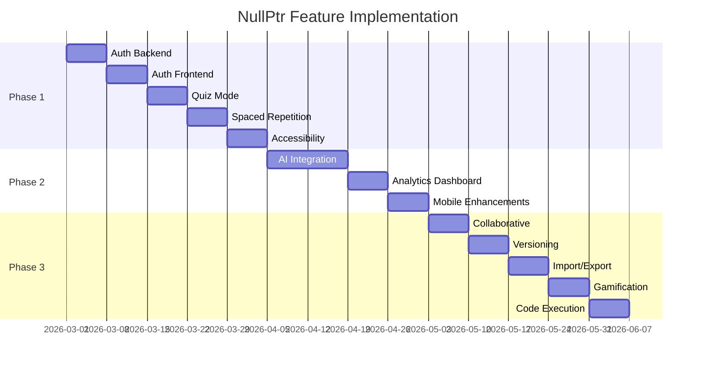

# NullPtr Complete Implementation Roadmap

## 📅 Overview

This roadmap details the implementation of all 12 proposed features across 3 phases, with specific tasks, file changes, and dependencies.

---

## 🗓️ Phase 1: Foundation (Weeks 1-4)

### Feature 1: User Authentication & Progress Tracking

#### Week 1: Backend Setup

**Day 1-2: Database Models**
```javascript
// backend/src_temp/models/User.js
const mongoose = require('mongoose');

const userSchema = new mongoose.Schema({
  email: { type: String, required: true, unique: true },
  passwordHash: { type: String, required: true },
  name: { type: String, required: true },
  avatar: { type: String },
  role: { type: String, enum: ['student', 'admin'], default: 'student' },
  createdAt: { type: Date, default: Date.now },
  lastLogin: { type: Date },
  preferences: {
    theme: { type: String, default: 'system' },
    aiProvider: { type: String },
    aiApiKey: { type: String }, // Encrypted
  }
});

// backend/src_temp/models/Progress.js
const progressSchema = new mongoose.Schema({
  userId: { type: mongoose.Schema.Types.ObjectId, ref: 'User', required: true },
  questionId: { type: String, required: true },
  questionType: { type: String, enum: ['mcq', 'fillblank', 'descriptive'], required: true },
  subjectId: { type: String, required: true },
  unitId: { type: String, required: true },
  
  // Progress data
  attempts: { type: Number, default: 0 },
  correctAttempts: { type: Number, default: 0 },
  lastAttemptAt: { type: Date },
  firstAttemptAt: { type: Date, default: Date.now },
  
  // For spaced repetition
  easeFactor: { type: Number, default: 2.5 },
  interval: { type: Number, default: 0 },
  nextReviewDate: { type: Date },
  repetitions: { type: Number, default: 0 },
  
  // Bookmarks
  isBookmarked: { type: Boolean, default: false },
  notes: { type: String }
});

// backend/src_temp/models/QuizAttempt.js
const quizAttemptSchema = new mongoose.Schema({
  userId: { type: mongoose.Schema.Types.ObjectId, ref: 'User', required: true },
  subjectId: { type: String },
  unitIds: [{ type: String }],
  
  // Quiz config
  totalQuestions: { type: Number, required: true },
  timeLimit: { type: Number }, // in seconds, null = untimed
  questionTypes: [{ type: String, enum: ['mcq', 'fillblank', 'descriptive'] }],
  
  // Results
  questions: [{
    questionId: String,
    questionType: String,
    isCorrect: Boolean,
    timeSpent: Number, // seconds
    userAnswer: mongoose.Schema.Types.Mixed
  }],
  
  score: { type: Number, required: true },
  maxScore: { type: Number, required: true },
  timeTaken: { type: Number }, // total seconds
  
  startedAt: { type: Date, default: Date.now },
  completedAt: { type: Date }
});
```

**Day 3-4: Authentication Controllers**
```javascript
// backend/src_temp/controllers/authController.js
const bcrypt = require('bcryptjs');
const jwt = require('jsonwebtoken');
const User = require('../models/User');

exports.register = async (req, res) => {
  try {
    const { email, password, name } = req.body;
    
    // Check existing user
    const existing = await User.findOne({ email });
    if (existing) {
      return res.status(400).json({ error: 'Email already registered' });
    }
    
    // Hash password
    const passwordHash = await bcrypt.hash(password, 12);
    
    // Create user
    const user = await User.create({
      email,
      passwordHash,
      name
    });
    
    // Generate token
    const token = jwt.sign(
      { userId: user._id, role: user.role },
      process.env.JWT_SECRET,
      { expiresIn: '7d' }
    );
    
    res.status(201).json({
      user: { id: user._id, email: user.email, name: user.name, role: user.role },
      token
    });
  } catch (error) {
    res.status(500).json({ error: error.message });
  }
};

exports.login = async (req, res) => {
  // Implementation
};

exports.oauthCallback = async (req, res) => {
  // Google/GitHub OAuth
};

exports.getProfile = async (req, res) => {
  // Return user profile
};

exports.updatePreferences = async (req, res) => {
  // Update user preferences including AI settings
};
```

**Day 5: Auth Middleware & Routes**
```javascript
// backend/src_temp/middlewares/auth.middleware.js
const jwt = require('jsonwebtoken');

exports.authenticate = (req, res, next) => {
  const token = req.headers.authorization?.split(' ')[1];
  
  if (!token) {
    return res.status(401).json({ error: 'Authentication required' });
  }
  
  try {
    const decoded = jwt.verify(token, process.env.JWT_SECRET);
    req.user = decoded;
    next();
  } catch (error) {
    res.status(401).json({ error: 'Invalid token' });
  }
};

// backend/src_temp/routes/authRouter.js
const express = require('express');
const router = express.Router();
const authController = require('../controllers/authController');
const { authenticate } = require('../middlewares/auth.middleware');

router.post('/register', authController.register);
router.post('/login', authController.login);
router.get('/profile', authenticate, authController.getProfile);
router.patch('/preferences', authenticate, authController.updatePreferences);

// OAuth routes
router.get('/google', authController.googleAuth);
router.get('/google/callback', authController.googleCallback);
router.get('/github', authController.githubAuth);
router.get('/github/callback', authController.githubCallback);

module.exports = router;
```

#### Week 2: Frontend Auth Implementation

**Files to Create/Modify:**
```
frontend/src/
├── contexts/
│   └── AuthContext.tsx          # Update existing
├── pages/
│   ├── Login.tsx                # New
│   ├── Register.tsx             # New
│   ├── Profile.tsx              # New
│   └── Settings.tsx             # New
├── components/
│   ├── AuthGuard.tsx            # New - Protected route wrapper
│   ├── LoginForm.tsx            # New
│   ├── RegisterForm.tsx         # New
│   └── UserMenu.tsx             # New
└── lib/
    └── auth.ts                  # New - Auth API functions
```

**Key Implementation:**
```tsx
// frontend/src/contexts/AuthContext.tsx
import { createContext, useContext, useState, useEffect, ReactNode } from 'react';
import { User, AuthState } from '@/types';

interface AuthContextType extends AuthState {
  login: (email: string, password: string) => Promise<void>;
  register: (email: string, password: string, name: string) => Promise<void>;
  logout: () => void;
  updatePreferences: (prefs: Partial<UserPreferences>) => Promise<void>;
}

const AuthContext = createContext<AuthContextType | null>(null);

export function AuthProvider({ children }: { children: ReactNode }) {
  const [user, setUser] = useState<User | null>(null);
  const [token, setToken] = useState<string | null>(
    localStorage.getItem('auth_token')
  );
  const [loading, setLoading] = useState(true);

  useEffect(() => {
    if (token) {
      fetchProfile(token).then(setUser).finally(() => setLoading(false));
    } else {
      setLoading(false);
    }
  }, [token]);

  // ... implementation
}

// frontend/src/components/AuthGuard.tsx
export function AuthGuard({ children }: { children: ReactNode }) {
  const { user, loading } = useAuth();
  const location = useLocation();

  if (loading) return <LoadingSpinner />;
  
  if (!user) {
    return <Navigate to="/login" state={{ from: location }} replace />;
  }

  return <>{children}</>;
}
```

---

### Feature 2: Quiz Mode with Timer

#### Week 2-3: Quiz Implementation

**Backend Routes:**
```javascript
// backend/src_temp/routes/quizRouter.js
router.post('/start', authenticate, quizController.startQuiz);
router.post('/:id/answer', authenticate, quizController.submitAnswer);
router.post('/:id/complete', authenticate, quizController.completeQuiz);
router.get('/history', authenticate, quizController.getHistory);
router.get('/:id', authenticate, quizController.getQuizDetails);
```

**Frontend Components:**
```tsx
// frontend/src/pages/Quiz.tsx
export default function QuizPage() {
  const [quiz, setQuiz] = useState<QuizSession | null>(null);
  const [currentQuestion, setCurrentQuestion] = useState(0);
  const [answers, setAnswers] = useState<Map<string, Answer>>(new Map());
  const [timeRemaining, setTimeRemaining] = useState<number | null>(null);

  // Timer effect
  useEffect(() => {
    if (!timeRemaining || timeRemaining <= 0) return;
    
    const timer = setInterval(() => {
      setTimeRemaining(t => {
        if (t <= 1) {
          handleCompleteQuiz();
          return 0;
        }
        return t - 1;
      });
    }, 1000);

    return () => clearInterval(timer);
  }, [timeRemaining]);

  return (
    <div>
      <QuizTimer remaining={timeRemaining} />
      <QuizProgress current={currentQuestion} total={quiz.questions.length} />
      <QuestionCard question={quiz.questions[currentQuestion]} />
      <QuizNavigation onNext={handleNext} onPrev={handlePrev} />
    </div>
  );
}

// frontend/src/components/QuizSetupDialog.tsx
export function QuizSetupDialog({ subjectId, unitIds }: Props) {
  const [config, setConfig] = useState<QuizConfig>({
    questionCount: 10,
    timeLimit: 600, // 10 minutes
    questionTypes: ['mcq', 'fillblank'],
    shuffle: true,
    negativeMarking: false
  });

  return (
    <Dialog>
      <DialogContent>
        <QuestionCountSlider value={config.questionCount} onChange={...} />
        <TimeLimitSelect value={config.timeLimit} onChange={...} />
        <QuestionTypeCheckboxes value={config.questionTypes} onChange={...} />
        <ShuffleToggle value={config.shuffle} onChange={...} />
        <StartQuizButton config={config} />
      </DialogContent>
    </Dialog>
  );
}
```

---

### Feature 3: Spaced Repetition System

#### Week 3-4: SRS Implementation

**SM-2 Algorithm:**
```typescript
// frontend/src/lib/spacedRepetition.ts
interface ReviewCard {
  id: string;
  easeFactor: number;
  interval: number;
  repetitions: number;
  nextReviewDate: Date;
}

type Rating = 0 | 1 | 2 | 3 | 4 | 5; // 0=complete fail, 5=perfect

export function calculateNextReview(card: ReviewCard, rating: Rating): ReviewCard {
  let { easeFactor, interval, repetitions } = card;

  // Update ease factor
  easeFactor = Math.max(
    1.3,
    easeFactor + (0.1 - (5 - rating) * (0.08 + (5 - rating) * 0.02))
  );

  if (rating < 3) {
    // Failed - reset
    repetitions = 0;
    interval = 1;
  } else {
    // Passed
    if (repetitions === 0) {
      interval = 1;
    } else if (repetitions === 1) {
      interval = 6;
    } else {
      interval = Math.round(interval * easeFactor);
    }
    repetitions++;
  }

  const nextReviewDate = new Date();
  nextReviewDate.setDate(nextReviewDate.getDate() + interval);

  return {
    ...card,
    easeFactor,
    interval,
    repetitions,
    nextReviewDate
  };
}

export function getDueCards(cards: ReviewCard[]): ReviewCard[] {
  const now = new Date();
  return cards.filter(card => card.nextReviewDate <= now)
    .sort((a, b) => a.nextReviewDate.getTime() - b.nextReviewDate.getTime());
}
```

**Review Page:**
```tsx
// frontend/src/pages/Review.tsx
export default function ReviewPage() {
  const { data: dueCards } = useQuery({
    queryKey: ['review', 'due'],
    queryFn: () => progressApi.getDueCards()
  });

  const [currentCard, setCurrentCard] = useState(0);
  const [showAnswer, setShowAnswer] = useState(false);

  const rateMutation = useMutation({
    mutationFn: (rating: Rating) => progressApi.rateCard(dueCards[currentCard].id, rating),
    onSuccess: () => {
      setCurrentCard(c => c + 1);
      setShowAnswer(false);
    }
  });

  if (!dueCards?.length) {
    return <AllCaughtUp />;
  }

  return (
    <div>
      <ReviewProgress current={currentCard} total={dueCards.length} />
      <ReviewCard card={dueCards[currentCard]} showAnswer={showAnswer} />
      
      {!showAnswer ? (
        <Button onClick={() => setShowAnswer(true)}>Show Answer</Button>
      ) : (
        <RatingButtons onRate={rateMutation.mutate} />
      )}
    </div>
  );
}
```

---

### Feature 4: Accessibility Improvements

#### Week 4: A11y Implementation

**Checklist:**
```markdown
## Accessibility Audit & Fixes

### 1. ARIA Labels
- [ ] Add aria-label to all icon-only buttons
- [ ] Add aria-describedby to form inputs with hints
- [ ] Add aria-live regions for dynamic content
- [ ] Add role="alert" for error messages

### 2. Keyboard Navigation
- [ ] Tab order follows visual order
- [ ] Focus trap in modals
- [ ] Escape closes modals/dropdowns
- [ ] Arrow keys navigate question options
- [ ] Enter/Space activates buttons

### 3. Focus Management
- [ ] Visible focus indicators (ring)
- [ ] Focus restoration after modal close
- [ ] Skip links for main content

### 4. Color & Contrast
- [ ] 4.5:1 contrast ratio for text
- [ ] 3:1 contrast ratio for UI components
- [ ] Don't rely on color alone for information

### 5. Motion & Animation
- [ ] Respect prefers-reduced-motion
- [ ] Pause/stop moving content
- [ ] No flashing content

### 6. Screen Reader Testing
- [ ] Test with NVDA (Windows)
- [ ] Test with VoiceOver (Mac/iOS)
- [ ] Test with TalkBack (Android)
```

**Implementation Example:**
```tsx
// frontend/src/components/MCQCard.tsx (updated)
export function MCQCard({ question, index }: Props) {
  const [selectedOption, setSelectedOption] = useState<number | null>(null);
  const [hasAnswered, setHasAnswered] = useState(false);

  const handleKeyDown = (e: React.KeyboardEvent, optionIndex: number) => {
    switch (e.key) {
      case 'Enter':
      case ' ':
        e.preventDefault();
        handleOptionClick(optionIndex);
        break;
      case 'ArrowDown':
        e.preventDefault();
        focusNextOption(optionIndex);
        break;
      case 'ArrowUp':
        e.preventDefault();
        focusPrevOption(optionIndex);
        break;
    }
  };

  return (
    <Card
      role="group"
      aria-labelledby={`question-${index}`}
    >
      <h3 id={`question-${index}`} className="...">
        {question.question}
      </h3>

      <div role="radiogroup" aria-label="Answer options">
        {question.options.map((option, idx) => (
          <button
            key={idx}
            role="radio"
            aria-checked={selectedOption === idx}
            aria-disabled={hasAnswered}
            tabIndex={selectedOption === idx ? 0 : -1}
            onKeyDown={(e) => handleKeyDown(e, idx)}
            onClick={() => handleOptionClick(idx)}
            className={cn(
              "focus:ring-2 focus:ring-purple-500 focus:ring-offset-2",
              hasAnswered && idx === question.correctAnswer && "bg-green-100"
            )}
          >
            <span className="sr-only">Option {String.fromCharCode(65 + idx)}:</span>
            {option}
          </button>
        ))}
      </div>

      {hasAnswered && (
        <div
          role="alert"
          aria-live="polite"
          className={isCorrect ? "text-green-600" : "text-blue-600"}
        >
          {isCorrect ? "Correct!" : "Explanation: " + question.explanation}
        </div>
      )}
    </Card>
  );
}

// Skip link component
export function SkipLink() {
  return (
    <a
      href="#main-content"
      className="sr-only focus:not-sr-only focus:absolute focus:top-4 focus:left-4 focus:z-50 focus:px-4 focus:py-2 focus:bg-purple-600 focus:text-white focus:rounded-lg"
    >
      Skip to main content
    </a>
  );
}
```

---

## 🗓️ Phase 2: Enhancement (Weeks 5-8)

### Feature 5: AI-Powered Features

#### Week 5-6: AI Integration

**AI Service Architecture:**
```typescript
// frontend/src/lib/ai/types.ts
export interface AIProvider {
  name: string;
  models: string[];
  requiresApiKey: boolean;
  localOnly: boolean;
}

export const AI_PROVIDERS: AIProvider[] = [
  { name: 'ollama', models: ['llama2', 'mistral', 'codellama'], requiresApiKey: false, localOnly: true },
  { name: 'openai', models: ['gpt-4o', 'gpt-4o-mini', 'gpt-4-turbo'], requiresApiKey: true, localOnly: false },
  { name: 'anthropic', models: ['claude-3-opus', 'claude-3-sonnet'], requiresApiKey: true, localOnly: false },
  { name: 'google', models: ['gemini-pro', 'gemini-pro-vision'], requiresApiKey: true, localOnly: false },
  { name: 'groq', models: ['llama2-70b', 'mixtral-8x7b'], requiresApiKey: true, localOnly: false },
];

// frontend/src/lib/ai/service.ts
export class AIService {
  private config: AIConfig | null = null;

  async initialize(): Promise<void> {
    // Load config from localStorage
    const saved = localStorage.getItem('ai_config');
    if (saved) {
      this.config = JSON.parse(saved);
    }
  }

  async checkOllamaAvailability(): Promise<boolean> {
    try {
      const response = await fetch('http://localhost:11434/api/tags');
      return response.ok;
    } catch {
      return false;
    }
  }

  async generate(prompt: string, options?: GenerateOptions): Promise<string> {
    if (!this.config) {
      throw new Error('AI_NOT_CONFIGURED');
    }

    if (this.config.provider === 'ollama') {
      return this.generateWithOllama(prompt, options);
    }

    return this.generateWithAPI(prompt, options);
  }

  private async generateWithOllama(prompt: string, options?: GenerateOptions): Promise<string> {
    const response = await fetch('http://localhost:11434/api/generate', {
      method: 'POST',
      headers: { 'Content-Type': 'application/json' },
      body: JSON.stringify({
        model: this.config!.model || 'llama2',
        prompt,
        stream: false,
        options: {
          temperature: options?.temperature || 0.7,
          num_predict: options?.maxTokens || 500
        }
      })
    });

    const data = await response.json();
    return data.response;
  }

  private async generateWithAPI(prompt: string, options?: GenerateOptions): Promise<string> {
    const { provider, apiKey, model } = this.config!;
    
    const endpoints: Record<string, string> = {
      openai: 'https://api.openai.com/v1/chat/completions',
      anthropic: 'https://api.anthropic.com/v1/messages',
      google: `https://generativelanguage.googleapis.com/v1/models/${model}:generateContent`,
      groq: 'https://api.groq.com/openai/v1/chat/completions'
    };

    // Provider-specific request formatting
    const response = await fetch(endpoints[provider], {
      method: 'POST',
      headers: {
        'Content-Type': 'application/json',
        'Authorization': `Bearer ${apiKey}`,
        ...(provider === 'anthropic' && { 'x-api-key': apiKey, 'anthropic-version': '2023-06-01' })
      },
      body: JSON.stringify(this.formatRequest(provider, model, prompt, options))
    });

    return this.parseResponse(provider, await response.json());
  }

  // ... helper methods
}
```

**AI UI Components:**
```tsx
// frontend/src/components/ai/AISettings.tsx
export function AISettings() {
  const [config, setConfig] = useState<AIConfig>({
    provider: 'ollama',
    model: 'llama2',
    apiKey: ''
  });
  const [ollamaAvailable, setOllamaAvailable] = useState(false);
  const [testing, setTesting] = useState(false);

  useEffect(() => {
    aiService.checkOllamaAvailability().then(setOllamaAvailable);
  }, []);

  const testConnection = async () => {
    setTesting(true);
    try {
      await aiService.generate('Say "Connection successful!"');
      toast.success('AI connection successful!');
    } catch (error) {
      toast.error('Connection failed: ' + error.message);
    } finally {
      setTesting(false);
    }
  };

  return (
    <Card>
      <CardHeader>
        <CardTitle>AI Configuration</CardTitle>
        <CardDescription>Configure your AI provider for enhanced features</CardDescription>
      </CardHeader>
      <CardContent className="space-y-4">
        <Select value={config.provider} onValueChange={v => setConfig(c => ({ ...c, provider: v }))}>
          <SelectTrigger>
            <SelectValue />
          </SelectTrigger>
          <SelectContent>
            <SelectItem value="ollama" disabled={!ollamaAvailable}>
              Ollama (Local) {!ollamaAvailable && "- Not running"}
            </SelectItem>
            <SelectItem value="openai">OpenAI</SelectItem>
            <SelectItem value="anthropic">Anthropic</SelectItem>
            <SelectItem value="google">Google Gemini</SelectItem>
            <SelectItem value="groq">Groq</SelectItem>
          </SelectContent>
        </Select>

        {config.provider !== 'ollama' && (
          <Input
            type="password"
            placeholder="Enter your API key"
            value={config.apiKey}
            onChange={e => setConfig(c => ({ ...c, apiKey: e.target.value }))}
          />
        )}

        <Select value={config.model} onValueChange={v => setConfig(c => ({ ...c, model: v }))}>
          {/* Model options based on provider */}
        </Select>

        <div className="flex gap-2">
          <Button onClick={testConnection} disabled={testing}>
            {testing ? <Loader2 className="animate-spin" /> : 'Test Connection'}
          </Button>
          <Button variant="outline" onClick={() => aiService.saveConfig(config)}>
            Save Configuration
          </Button>
        </div>
      </CardContent>
    </Card>
  );
}

// frontend/src/components/ai/AIExplanationButton.tsx
export function AIExplanationButton({ question, answer }: Props) {
  const [explanation, setExplanation] = useState<string | null>(null);
  const [loading, setLoading] = useState(false);

  const generateExplanation = async () => {
    setLoading(true);
    try {
      const prompt = `Explain this question and answer in simple terms:

Question: ${question}
Correct Answer: ${answer}

Provide a clear, educational explanation that helps a student understand the concept.`;

      const result = await aiService.generate(prompt);
      setExplanation(result);
    } catch (error) {
      toast.error('Failed to generate explanation');
    } finally {
      setLoading(false);
    }
  };

  return (
    <div>
      <Button
        variant="ghost"
        size="sm"
        onClick={generateExplanation}
        disabled={loading}
      >
        <Sparkles className="w-4 h-4 mr-2" />
        {loading ? 'Generating...' : 'AI Explanation'}
      </Button>

      {explanation && (
        <Alert className="mt-2">
          <Sparkles className="w-4 h-4" />
          <AlertTitle>AI Generated Explanation</AlertTitle>
          <AlertDescription>{explanation}</AlertDescription>
        </Alert>
      )}
    </div>
  );
}
```

---

### Feature 6: Enhanced Analytics Dashboard

#### Week 6-7: Analytics Implementation

**Backend Aggregation:**
```javascript
// backend/src_temp/controllers/analyticsController.js
exports.getStudentAnalytics = async (req, res) => {
  const { userId } = req.user;
  const { timeRange = '30d' } = req.query;

  const progress = await Progress.aggregate([
    { $match: { userId: mongoose.Types.ObjectId(userId) } },
    {
      $facet: {
        bySubject: [
          {
            $group: {
              _id: '$subjectId',
              totalAttempts: { $sum: '$attempts' },
              correctAttempts: { $sum: '$correctAttempts' },
              accuracy: {
                $avg: { $divide: ['$correctAttempts', '$attempts'] }
              }
            }
          }
        ],
        byType: [
          {
            $group: {
              _id: '$questionType',
              count: { $sum: 1 },
              avgAccuracy: {
                $avg: { $divide: ['$correctAttempts', '$attempts'] }
              }
            }
          }
        ],
        recentActivity: [
          { $sort: { lastAttemptAt: -1 } },
          { $limit: 50 },
          {
            $group: {
              _id: {
                $dateToString: { format: '%Y-%m-%d', date: '$lastAttemptAt' }
              },
              count: { $sum: 1 }
            }
          },
          { $sort: { _id: 1 } }
        ],
        weakAreas: [
          {
            $match: { attempts: { $gte: 3 } }
          },
          {
            $project: {
              subjectId: 1,
              unitId: 1,
              topic: 1,
              accuracy: { $divide: ['$correctAttempts', '$attempts'] }
            }
          },
          { $match: { accuracy: { $lt: 0.6 } } },
          { $sort: { accuracy: 1 } },
          { $limit: 10 }
        ]
      }
    }
  ]);

  res.json(progress[0]);
};
```

**Frontend Charts:**
```tsx
// frontend/src/pages/Analytics.tsx
export default function AnalyticsPage() {
  const { data: analytics } = useQuery({
    queryKey: ['analytics'],
    queryFn: () => analyticsApi.getStudentAnalytics()
  });

  return (
    <div className="grid gap-6">
      {/* Overview Cards */}
      <div className="grid grid-cols-4 gap-4">
        <StatCard
          title="Questions Practiced"
          value={analytics?.totalQuestions}
          trend={analytics?.weeklyTrend}
        />
        <StatCard
          title="Overall Accuracy"
          value={`${(analytics?.accuracy * 100).toFixed(1)}%`}
        />
        <StatCard
          title="Current Streak"
          value={`${analytics?.streak} days`}
        />
        <StatCard
          title="Cards Due"
          value={analytics?.dueCards}
        />
      </div>

      {/* Charts Row */}
      <div className="grid grid-cols-2 gap-6">
        <Card>
          <CardHeader>
            <CardTitle>Activity Heatmap</CardTitle>
          </CardHeader>
          <CardContent>
            <ActivityHeatmap data={analytics?.recentActivity} />
          </CardContent>
        </Card>

        <Card>
          <CardHeader>
            <CardTitle>Accuracy Trend</CardTitle>
          </CardHeader>
          <CardContent>
            <LineChart data={analytics?.accuracyTrend} />
          </CardContent>
        </Card>
      </div>

      {/* Subject Breakdown */}
      <Card>
        <CardHeader>
          <CardTitle>Performance by Subject</CardTitle>
        </CardHeader>
        <CardContent>
          <RadarChart data={analytics?.bySubject} />
        </CardContent>
      </Card>

      {/* Weak Areas */}
      <Card>
        <CardHeader>
          <CardTitle>Areas to Improve</CardTitle>
        </CardHeader>
        <CardContent>
          <WeakAreasList areas={analytics?.weakAreas} />
        </CardContent>
      </Card>
    </div>
  );
}
```

---

### Feature 7: Mobile App Enhancements

#### Week 7-8: Mobile Improvements

**PWA Updates:**
```javascript
// frontend/public/sw.js (updated)
const CACHE_NAME = 'nullptr-v2';
const SYNC_TAG = 'sync-progress';

// Background sync for offline progress
self.addEventListener('sync', event => {
  if (event.tag === SYNC_TAG) {
    event.waitUntil(syncProgress());
  }
});

async function syncProgress() {
  const pendingProgress = await getPendingProgress();
  
  for (const progress of pendingProgress) {
    try {
      await fetch('/api/progress/sync', {
        method: 'POST',
        headers: { 'Content-Type': 'application/json' },
        body: JSON.stringify(progress)
      });
      await removePendingProgress(progress.id);
    } catch (error) {
      console.error('Sync failed for', progress.id);
    }
  }
}

// Push notifications
self.addEventListener('push', event => {
  const data = event.data?.json() ?? {};
  
  const options = {
    body: data.body || 'Time to review!',
    icon: '/android-chrome-192x192.png',
    badge: '/favicon-32x32.png',
    vibrate: [100, 50, 100],
    data: {
      url: data.url || '/'
    },
    actions: [
      { action: 'review', title: 'Start Review' },
      { action: 'dismiss', title: 'Later' }
    ]
  };

  event.waitUntil(
    self.registration.showNotification(data.title || 'NullPtr', options)
  );
});

self.addEventListener('notificationclick', event => {
  event.notification.close();

  if (event.action === 'review') {
    event.waitUntil(clients.openWindow('/review'));
  }
});
```

**Mobile Gestures:**
```tsx
// frontend/src/hooks/useSwipeGesture.ts
export function useSwipeGesture(onSwipeLeft: () => void, onSwipeRight: () => void) {
  const [touchStart, setTouchStart] = useState<number | null>(null);
  const [touchEnd, setTouchEnd] = useState<number | null>(null);

  const minSwipeDistance = 50;

  const onTouchStart = (e: React.TouchEvent) => {
    setTouchEnd(null);
    setTouchStart(e.targetTouches[0].clientX);
  };

  const onTouchMove = (e: React.TouchEvent) => {
    setTouchEnd(e.targetTouches[0].clientX);
  };

  const onTouchEnd = () => {
    if (!touchStart || !touchEnd) return;

    const distance = touchStart - touchEnd;
    const isLeftSwipe = distance > minSwipeDistance;
    const isRightSwipe = distance < -minSwipeDistance;

    if (isLeftSwipe) onSwipeLeft();
    if (isRightSwipe) onSwipeRight();
  };

  return { onTouchStart, onTouchMove, onTouchEnd };
}

// Usage in QuizPage
function QuizPage() {
  const { onTouchStart, onTouchMove, onTouchEnd } = useSwipeGesture(
    () => handleNext(),
    () => handlePrev()
  );

  return (
    <div
      onTouchStart={onTouchStart}
      onTouchMove={onTouchMove}
      onTouchEnd={onTouchEnd}
    >
      {/* Quiz content */}
    </div>
  );
}
```

---

## 🗓️ Phase 3: Advanced Features (Weeks 9-12)

### Feature 8: Collaborative Features

#### Week 9-10: Social Features

**Database Models:**
```javascript
// backend/src_temp/models/Comment.js
const commentSchema = new mongoose.Schema({
  questionId: { type: String, required: true },
  questionType: { type: String, enum: ['mcq', 'fillblank', 'descriptive'] },
  userId: { type: mongoose.Schema.Types.ObjectId, ref: 'User' },
  content: { type: String, required: true, maxlength: 1000 },
  likes: [{ type: mongoose.Schema.Types.ObjectId, ref: 'User' }],
  isReported: { type: Boolean, default: false },
  createdAt: { type: Date, default: Date.now }
});

// backend/src_temp/models/StudyGroup.js
const studyGroupSchema = new mongoose.Schema({
  name: { type: String, required: true },
  description: { type: String },
  createdBy: { type: mongoose.Schema.Types.ObjectId, ref: 'User' },
  members: [{ type: mongoose.Schema.Types.ObjectId, ref: 'User' }],
  subjects: [{ type: String }],
  isPublic: { type: Boolean, default: true },
  inviteCode: { type: String, unique: true }
});
```

---

### Feature 9: Content Versioning

#### Week 10: Version History

**Implementation:**
```javascript
// backend/src_temp/models/QuestionHistory.js
const questionHistorySchema = new mongoose.Schema({
  questionId: { type: String, required: true },
  questionType: { type: String, required: true },
  version: { type: Number, required: true },
  data: { type: mongoose.Schema.Types.Mixed, required: true },
  changedBy: { type: mongoose.Schema.Types.ObjectId, ref: 'User' },
  changedAt: { type: Date, default: Date.now },
  changeReason: { type: String }
});

// Middleware to auto-version on update
questionSchema.pre('findOneAndUpdate', async function() {
  const doc = await this.model.findOne(this.getQuery());
  if (doc) {
    await QuestionHistory.create({
      questionId: doc._id,
      questionType: doc.constructor.modelName.toLowerCase(),
      version: doc.__v + 1,
      data: doc.toObject(),
      changedBy: this.getUpdate().changedBy
    });
  }
});
```

---

### Feature 10: Import/Export Enhancements

#### Week 11: Data Portability

**Export Service:**
```typescript
// frontend/src/lib/export.ts
export async function exportToAnki(progress: Progress[]): Promise<Blob> {
  const deck = {
    name: 'NullPtr Export',
    cards: progress.map(p => ({
      front: p.question,
      back: p.answer,
      tags: [p.subject, p.unit, p.topic].filter(Boolean)
    }))
  };

  // Generate .apkg file
  return generateAnkiPackage(deck);
}

export async function exportToCSV(data: any[]): Promise<Blob> {
  const headers = Object.keys(data[0]);
  const rows = data.map(row => headers.map(h => JSON.stringify(row[h] ?? '')).join(','));
  const csv = [headers.join(','), ...rows].join('\n');
  return new Blob([csv], { type: 'text/csv' });
}
```

---

### Feature 11: Gamification Elements

#### Week 11-12: Game Mechanics

**Achievement System:**
```typescript
// backend/src_temp/models/Achievement.js
const achievementSchema = new mongoose.Schema({
  userId: { type: mongoose.Schema.Types.ObjectId, ref: 'User' },
  type: { type: String, required: true },
  earnedAt: { type: Date, default: Date.now },
  metadata: { type: mongoose.Schema.Types.Mixed }
});

// Achievement definitions
const ACHIEVEMENTS = {
  FIRST_STEPS: { name: 'First Steps', description: 'Complete 10 questions', icon: '🎯' },
  QUICK_LEARNER: { name: 'Quick Learner', description: '90% accuracy in a unit', icon: '⚡' },
  STREAK_MASTER: { name: 'Streak Master', description: '7-day practice streak', icon: '🔥' },
  SUBJECT_EXPERT: { name: 'Subject Expert', description: 'Complete all questions', icon: '🎓' },
  NIGHT_OWL: { name: 'Night Owl', description: 'Practice after midnight', icon: '🦉' },
  EARLY_BIRD: { name: 'Early Bird', description: 'Practice before 6 AM', icon: '🐦' },
  CENTURY: { name: 'Century', description: 'Answer 100 questions', icon: '💯' },
  PERFECTIONIST: { name: 'Perfectionist', description: '100% on a quiz', icon: '✨' }
};

// Check achievements middleware
async function checkAchievements(userId: string, event: string, data: any) {
  const user = await User.findById(userId);
  const progress = await Progress.find({ userId });
  
  const newAchievements = [];

  // Check each achievement condition
  if (event === 'question_answered') {
    const totalAnswered = progress.reduce((sum, p) => sum + p.attempts, 0);
    if (totalAnswered >= 10 && !user.achievements.includes('FIRST_STEPS')) {
      newAchievements.push('FIRST_STEPS');
    }
    if (totalAnswered >= 100 && !user.achievements.includes('CENTURY')) {
      newAchievements.push('CENTURY');
    }
  }

  // Award achievements
  for (const type of newAchievements) {
    await Achievement.create({ userId, type });
    // Send notification
    await sendAchievementNotification(userId, ACHIEVEMENTS[type]);
  }

  return newAchievements;
}
```

---

### Feature 12: Code Execution Environment

#### Week 12: Code Runner

**Sandboxed Execution:**
```tsx
// frontend/src/components/CodeEditor.tsx
import Editor from '@monaco-editor/react';

export function CodeEditor({ question, onRun }: Props) {
  const [code, setCode] = useState(question.starterCode || '');
  const [output, setOutput] = useState('');
  const [running, setRunning] = useState(false);

  const runCode = async () => {
    setRunning(true);
    try {
      const result = await executeCode({
        language: question.language,
        code,
        testCases: question.testCases
      });
      setOutput(result.output);
      
      if (result.passed) {
        toast.success('All test cases passed!');
      } else {
        toast.error(`${result.passed}/${result.total} test cases passed`);
      }
    } catch (error) {
      setOutput(`Error: ${error.message}`);
    } finally {
      setRunning(false);
    }
  };

  return (
    <div className="grid grid-cols-2 gap-4">
      <div>
        <div className="flex justify-between mb-2">
          <Select value={question.language} disabled>
            <SelectTrigger className="w-32" />
          </Select>
          <Button onClick={runCode} disabled={running}>
            {running ? <Loader2 className="animate-spin" /> : 'Run Code'}
          </Button>
        </div>
        <Editor
          height="400px"
          language={question.language}
          value={code}
          onChange={setCode}
          theme="vs-dark"
          options={{
            minimap: { enabled: false },
            fontSize: 14
          }}
        />
      </div>
      <div>
        <h4 className="font-semibold mb-2">Output</h4>
        <pre className="bg-slate-900 text-green-400 p-4 rounded-lg h-[400px] overflow-auto">
          {output || 'Run your code to see output...'}
        </pre>
      </div>
    </div>
  );
}

// Backend execution using Piston API
async function executeCode({ language, code, testCases }: ExecuteRequest) {
  const response = await fetch('https://emkc.org/api/v2/piston/execute', {
    method: 'POST',
    headers: { 'Content-Type': 'application/json' },
    body: JSON.stringify({
      language: language === 'python' ? 'python3' : language,
      version: '*',
      files: [{ name: 'main', content: code }]
    })
  });

  return response.json();
}
```

---

## 📊 Implementation Timeline



---

## 🔧 Technical Dependencies

### New npm packages required:

**Frontend:**
```json
{
  "dependencies": {
    "@monaco-editor/react": "^4.6.0",
    "recharts": "^2.12.0",
    "framer-motion": "^11.0.0",
    "date-fns": "^3.3.0",
    "bcryptjs": "^2.4.3",
    "react-hot-toast": "^2.4.1"
  }
}
```

**Backend:**
```json
{
  "dependencies": {
    "jsonwebtoken": "^9.0.2",
    "bcryptjs": "^2.4.3",
    "passport": "^0.7.0",
    "passport-google-oauth20": "^2.0.0",
    "passport-github2": "^0.1.12",
    "node-cron": "^3.0.3"
  }
}
```

---

## 📝 Environment Variables

```env
# Backend .env additions
JWT_SECRET=your-super-secret-jwt-key
JWT_EXPIRES_IN=7d

# OAuth (optional)
GOOGLE_CLIENT_ID=your-google-client-id
GOOGLE_CLIENT_SECRET=your-google-client-secret
GITHUB_CLIENT_ID=your-github-client-id
GITHUB_CLIENT_SECRET=your-github-client-secret

# AI Features (optional - users can provide their own)
DEFAULT_AI_PROVIDER=ollama
```

---

*Document created: February 2026*
*Total estimated implementation: 12 weeks*
